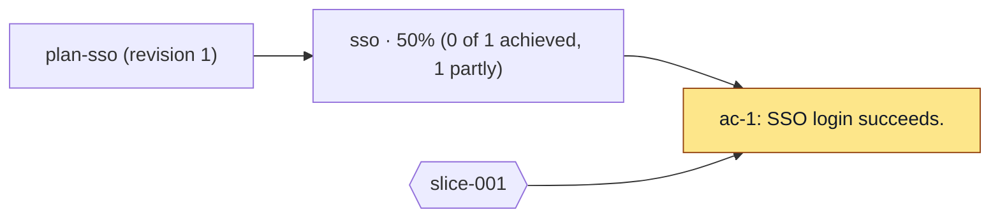

# ORBIT

ORBIT is a portable planning and reconciliation standard for durable software intent, current project reality, and the next bounded execution change.

ORBIT is part of [Agent SDLC](https://agentsdlc.ai). Visit the project website at [orbitspec.dev](https://orbitspec.dev).

This repository is the source for the standard, its schemas, examples, validators, and skills. The website is published separately so the standard can be used without a website or a specific coding harness.

## Current status

ORBIT v0.1 is under development. The repository begins with the four record schemas and examples that currently live in the website repository. The initial Plan, Project Snapshot, Reconciliation, and Execution Slice are under [`orbit/`](orbit/).

## Records

- **Plan** — durable intent, outcomes, acceptance criteria, constraints, and planning knowledge.
- **ProjectSnapshot** — point-in-time project and repository state.
- **Reconciliation** — assessment of a Plan against observed evidence.
- **ExecutionSlice** — the next bounded change justified by a Reconciliation.

## Validate

```sh
npm install
npm test
```

The validator checks every example and every record under `orbit/` against its JSON Schema and verifies the cross-record references in the complete fixture set.

The portable CLI exposes the same operations to any harness:

```sh
npx orbit validate --all
npx orbit validate --all --root docs/orbit
npx orbit plan examples/plan-minimal.json
npx orbit snapshot examples/project-snapshot-minimal.json
npx orbit reconcile examples/reconciliation-minimal.json
npx orbit slice examples/slice-minimal.json
```

`orbit validate --all` validates the package fixture set (`examples/` and `orbit/`).

`orbit validate --all --root <directory>` validates only the record directories under that root (`plans/`, `snapshots/`, `reconciliations/`, `slices/`). It does not read the package fixtures. Harness adapters that store project records outside this repository must pass `--root`.

Harness adapters should call these commands and preserve their exit status. They must not replace ORBIT validation with harness-specific rules.

The lifecycle commands also create records from explicit inputs:

```sh
npx orbit snapshot --project my-project --repository app --path . --output snapshot.json
npx orbit snapshot --project my-project \
  --repository web --path ../web \
  --repository api --path ../api \
  --output project-snapshot.json
npx orbit reconcile --plan plan.json --snapshot snapshot.json --output reconciliation.json
npx orbit slice --plan plan.json --reconciliation reconciliation.json \
  --outcome outcome-id --objective "Bounded change" --why "Evidence supports this change" \
  --output slice.json
```

Before a provider write, validate and preview the complete record chain:

```sh
npx orbit sync github \
  --plan examples/plan-sso.json \
  --snapshot examples/project-snapshot-2026-09-14.json \
  --reconciliation examples/reconciliation-001.json \
  --slice examples/slice-001.json \
  --repo owner/repository \
  --dry-run
```

The GitHub adapter rejects inconsistent projects, Plan revisions, outcomes, acceptance criteria, incomplete Reconciliation assessments, and repository provenance before it calls GitHub. Remove `--dry-run` only after you review the proposed issue. The CLI does not infer intent. Harnesses provide explicit inputs and apply their own workflow rules.

## Progress

`orbit progress --root <directory> [--plan <id>] [--output <file>] [--direction TD|LR]` produces a Markdown progress report with a Mermaid graph, an Outcomes table, and an acceptance-criteria table:

```sh
node bin/orbit.js progress --root orbit
node bin/orbit.js progress --root docs/orbit --plan plan-sso --output reports/progress.md
node bin/orbit.js progress --root orbit --direction TD
```

The graph defaults to left-to-right (`graph LR`). Use `--direction TD` for top-down or `--direction LR` explicitly for left-to-right. Values are case-sensitive; anything other than `TD` or `LR` is rejected.

The command reads JSON records from `plans/`, `reconciliations/`, and `slices/` under the root and validates them with the existing schemas before producing output. It selects the highest Plan `revision`, the latest Reconciliation for that Plan ID by `reconciledAt` (ties use ID order), and every Slice for that Plan ID. If multiple Plan IDs exist, pass `--plan <id>`; otherwise the command reports the ambiguity. Reconciliations and slices may come from earlier Plan revisions. Snapshots are not required.

Without a Reconciliation, or for a criterion without an assessment, the status is `not-verified`. Each outcome's percentage averages its criteria: `achieved` counts as 1, `partially-verified` as 0.5, and other statuses as 0. Percentages round to whole numbers; outcomes with no criteria show 0%. Slice hexagons link to their contributed criteria.

The Plan node shows its ID and revision; its title stays in the heading. Outcome nodes show `<outcome-id> · <percent>% (<achieved> of <total> achieved, <partial> partly)` on one line. The Outcomes table retains each outcome's full title alongside its ID, percentage, achieved count, partly verified count, and total. Criterion nodes show the criterion ID and up to the first 45 characters of the statement, with whitespace normalized, shortened at a word boundary and followed by an ellipsis when truncated (a first word longer than 45 characters is cut at the limit). Slice nodes show only their IDs. Graph labels are escaped; the criteria table retains outcome titles, full statements, and the first evidence item.

Output is sorted by ID and repeatable, with no generated timestamp. Without `--output` it goes to standard output; with `--output` it is written to the file, creating parent directories as needed. Invalid records cause a non-zero exit before any report is written.

To try the complete SSO example, stage the flat `examples/` records into a temporary root:

```sh
example_root="$(mktemp -d)"
mkdir -p "$example_root/plans" "$example_root/reconciliations" "$example_root/slices"
cp examples/plan-sso.json "$example_root/plans/"
cp examples/reconciliation-001.json "$example_root/reconciliations/"
cp examples/slice-001.json "$example_root/slices/"
node bin/orbit.js progress --root "$example_root"
rm -r "$example_root"
```

This produces:

````markdown
# Corporate SSO (revision 1)

Reconciliation: reconciliation-001 (2026-09-14T16:05:00Z)



## Outcomes

| ID | Title | Percent | Achieved | Partly | Total |
| --- | --- | --- | --- | --- | --- |
| sso | Corporate users authenticate with SSO. | 50% | 0 | 1 | 1 |

## Criteria

| Criterion ID | Outcome ID | Outcome title | Status | First evidence | Statement |
| --- | --- | --- | --- | --- | --- |
| ac-1 | sso | Corporate users authenticate with SSO. | partially-verified | {"kind":"repository","repositoryId":"web","commit":"81fee032","path":"src/auth/provider.ts"} | SSO login succeeds. |

Legend: grey = not-verified; amber = partially-verified; green = achieved; red = contradicted. Hexagons are slices.

Outcome progress: achieved = 1, partially-verified = 0.5, other = 0; averaged over its criteria and rounded to a whole percent (0% with no criteria).
````

## Scope

ORBIT does not require a specific agent, issue tracker, branch strategy, repository layout, storage system, or execution provider.

## Licensing

Specification and documentation are licensed under [CC BY 4.0](LICENSE). Code, scripts, and skills are licensed under [MIT](LICENSE-CODE).

## Contributors

<a href="https://github.com/me2resh" title="me2resh"></a>
